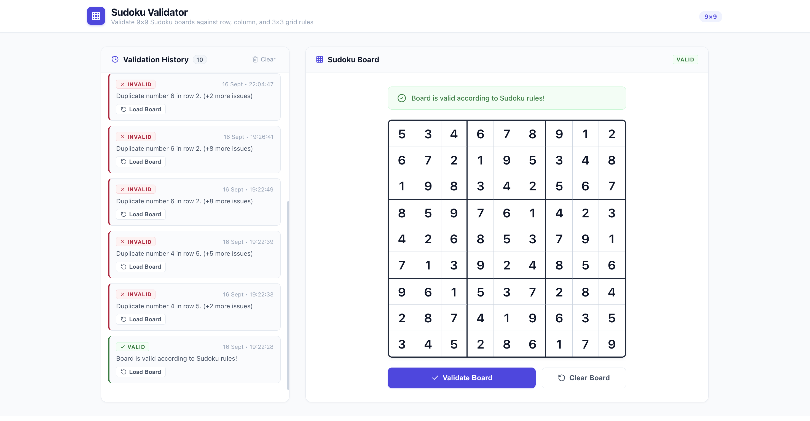
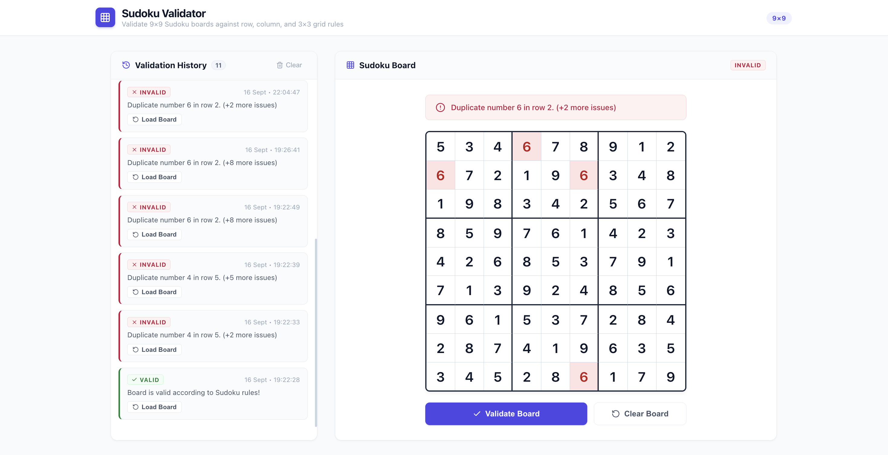

# Sudoku Validator

A clean, full-stack Sudoku validator web application. Built with React and Vite on the frontend, Node.js and Express on the backend, and SQLite with Prisma ORM for data storage.

It allows you to enter numbers on a 9x9 grid, validates the board against standard Sudoku rules, highlights any conflicts, and keeps a persistent history of previous checks in an SQLite database.

---

## Screenshots

### Valid Board
When all filled numbers satisfy row, column, and 3×3 grid rules:



### Conflict Highlighting (Invalid Board)
If there are duplicate values, the app flags the rule violation and highlights the conflicting cells in red:



---

## What It Does

- **Interactive 9×9 Grid**: Type numbers `1` through `9`, clear with `Backspace`, `Delete`, or `0`, and move around with arrow keys (`↑`, `↓`, `←`, `→`). Cells automatically advance as you type.
- **Rule Validation**: The backend checks:
  - All filled cells contain integers from 1 to 9 (blank cells are allowed).
  - No duplicate numbers in any row.
  - No duplicate numbers in any column.
  - No duplicate numbers in any of the nine 3×3 subgrids.
- **Visual Conflict Feedback**: Any violating cells light up in red so you can easily spot where the collision happened.
- **Validation History**: Every validation check is automatically saved with its timestamp, status, and board state into SQLite via Prisma.
- **Board Reloading**: You can click **Load Board** on any history entry to restore that exact board state back onto the grid.

---

## Tech Stack

- **Frontend**: React 18, Vite, Lucide Icons, Vanilla CSS
- **Backend**: Node.js, Express (ES modules, CORS, JSON middleware)
- **Database**: SQLite
- **ORM**: Prisma

---

## Project Structure

```
Sudoku/
├── assets/
│   ├── valid-board.png        # Screenshot of valid state
│   └── invalid-board.png      # Screenshot of conflict state
├── backend/
│   ├── prisma/
│   │   ├── schema.prisma      # Prisma schema (ValidationHistory model)
│   │   └── dev.db             # Local SQLite database
│   ├── src/
│   │   ├── validator.js       # Pure Sudoku validation logic
│   │   └── server.js          # Express API server
│   ├── test-validator.js      # Unit tests for validation edge cases
│   ├── .env                   # Port and database URL
│   └── package.json
├── frontend/
│   ├── src/
│   │   ├── components/
│   │   │   ├── SudokuGrid.jsx       # 9×9 interactive grid
│   │   │   ├── HistoryList.jsx      # Validation history sidebar
│   │   │   └── ValidationBanner.jsx # Status banner
│   │   ├── App.jsx                  # Main application state & API calls
│   │   ├── App.css                  # Custom styling & responsive layout
│   │   └── main.jsx
│   ├── vite.config.js               # Dev proxy configuration (/api -> 5001)
│   └── package.json
├── package.json               # Root scripts
└── README.md
```

---

## Getting Started

### 1. Prerequisites
- Node.js (v18+ recommended)
- npm

### 2. Installation
Install dependencies for both frontend and backend:

```bash
npm run install:all
```

*(Or run `npm install` inside both `backend/` and `frontend/` folders).*

The SQLite database (`dev.db`) is already included, but if you ever want to re-sync the schema:

```bash
cd backend
npx prisma db push
```

---

## Running the App

Run the backend and frontend in two separate terminals:

**Terminal 1 (Backend):**
```bash
cd backend
npm run dev
```
Server runs on `http://localhost:5001`

**Terminal 2 (Frontend):**
```bash
cd frontend
npm run dev
```
Frontend runs on `http://localhost:3000`

Open **http://localhost:3000** in your browser.

---

## Running Tests

A unit test suite in the backend tests all Sudoku validation rules and edge cases (ragged rows, decimal values, out-of-range numbers, partial boards, empty boards, etc.):

```bash
cd backend
node test-validator.js
```

---

## API Reference

| Method | Endpoint | Description |
|---|---|---|
| `GET` | `/api/health` | Health check endpoint |
| `POST` | `/api/validate` | Validates a 9×9 board payload and stores the result in SQLite |
| `GET` | `/api/history` | Retrieves recent validation history records, newest first |
| `DELETE` | `/api/history` | Clears all validation history records |
